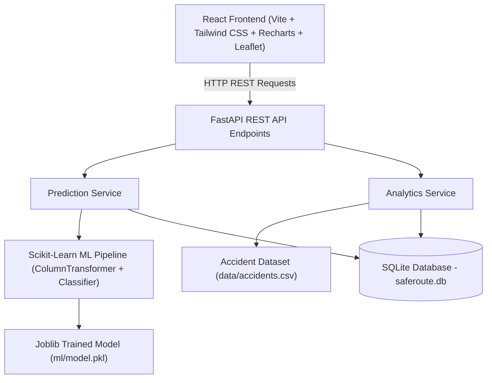
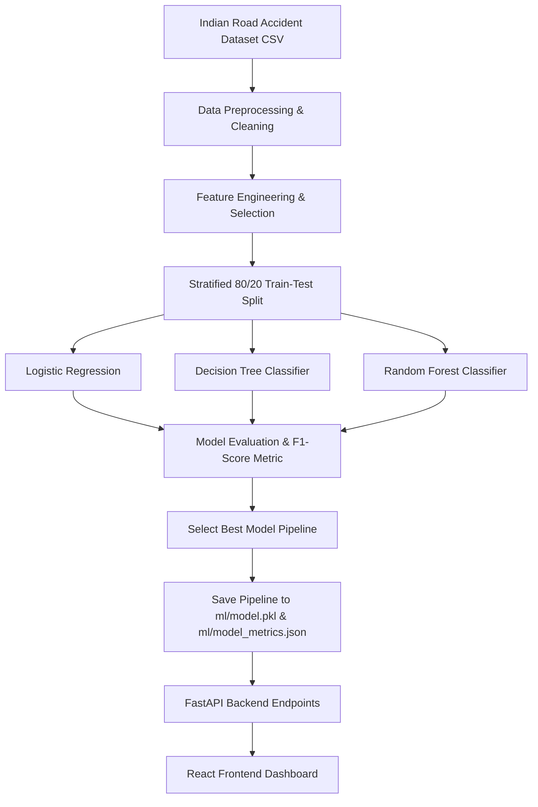
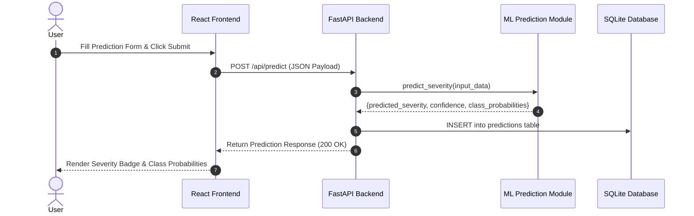
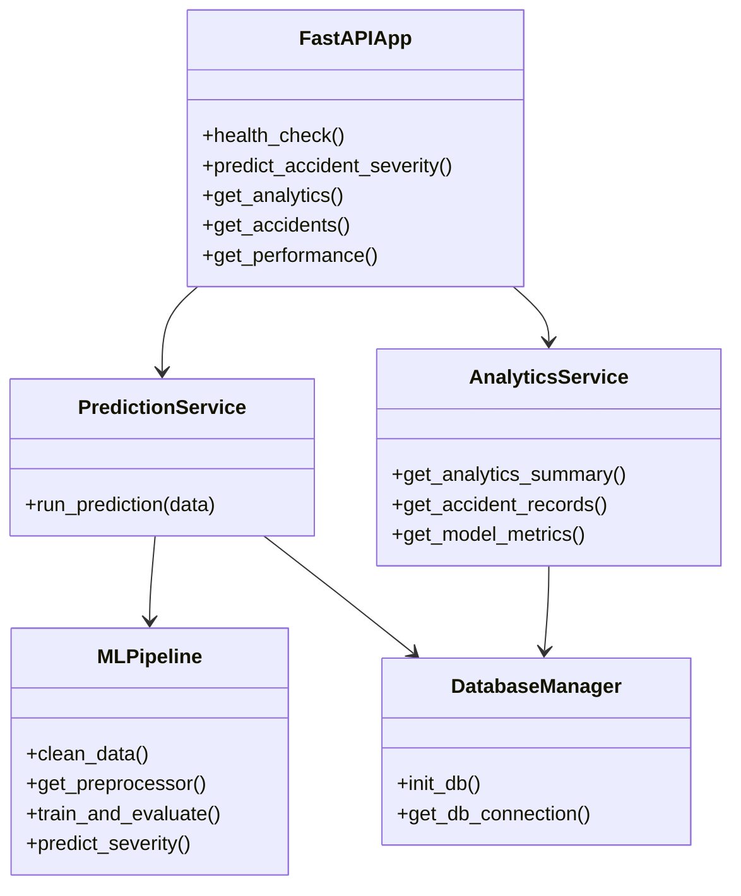
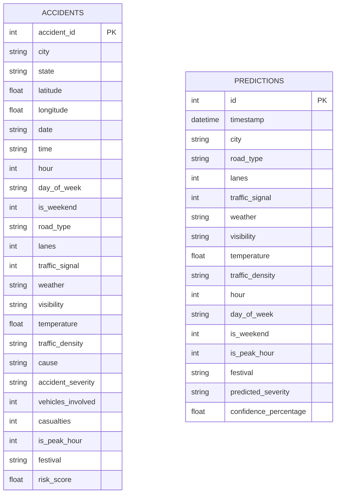

# SafeRoute AI — Academic Project Report
## Road Accident Risk & Severity Analysis System

---

### 1. COVER PAGE

| Field | Detail |
|---|---|
| **Project Title** | SafeRoute AI — Road Accident Risk & Severity Analysis System |
| **Project Type** | Capstone Academic Project (Artificial Intelligence / Machine Learning) |
| **Domain** | Machine Learning, Data Science, Data Visualization & Web Engineering |
| **Primary Dataset** | Indian Road Accident Dataset 2022–2025 (Kaggle) |
| **Dataset Source** | [Kaggle Dataset Link](https://www.kaggle.com/datasets/sehaj1104/indian-road-accident-dataset-20222025) |
| **Target Variable** | Multiclass Accident Severity (`Minor`, `Major`, `Fatal`) |
| **Key Technologies** | Python 3.10, Scikit-Learn, Pandas, NumPy, FastAPI, SQLite, React 18, Vite, Tailwind CSS, Recharts, Leaflet, Pytest |
| **Submission Date** | September 2026 |

---

### 2. INTRODUCTION

Road transportation is a backbone of economic activity in India, yet it is accompanied by high incidence rates of road traffic crashes, casualties, and infrastructure damages. Analyzing the severity of accidents under diverse environmental, temporal, and road infrastructure conditions is crucial for urban planners, law enforcement agencies, and highway transport authorities to formulate evidence-based safety interventions.

**SafeRoute AI** is a comprehensive, academic decision-support system designed to process, analyze, and predict road accident severity based on historical records from the **Indian Road Accident Dataset (2022–2025)**, containing 20,000 incident instances.

The application integrates machine learning classifiers (Logistic Regression, Decision Tree, Random Forest) with an automated evaluation and model selection pipeline. The best-performing model is deployed through a high-performance **FastAPI REST backend** and served to an intuitive **React single-page dashboard** featuring interactive charts, geospatial hotspot mapping, and instant severity prediction interfaces.

---

### 3. PROBLEM STATEMENT & OBJECTIVES

#### 3.1 Problem Statement
Traffic accidents in Indian urban corridors and state/national highways result from non-linear interactions among multiple environmental variables (weather, visibility, ambient temperature), temporal factors (hour of day, day of week, weekend, peak hours, festival contexts), and road layout characteristics (road type, number of lanes, traffic signals).

Traditional traffic analysis tools rely primarily on retrospective statistical tabulations, lacking predictive decision-support capabilities and interactive analytical dashboards. Furthermore, outcome variables recorded post-incident (such as total casualties or vehicles involved) cannot be used prior to an event for predictive risk assessment.

There is a critical academic and engineering need for an integrated system that:
1. Isolates pre-accident environmental and road features to prevent data leakage.
2. Automates preprocessing, feature encoding, model training, and empirical performance evaluation.
3. Exposes reliable, on-demand prediction endpoints via a REST API.
4. Delivers clear visual analytics and geospatial risk mapping for academic evaluation.

#### 3.2 Objectives
1. **Data Acquisition & Preprocessing**: Clean raw dataset records (20,000 samples, 24 columns), handle missing categorical values (such as `festival` NaNs), impute missing attributes, and standardize categorical text formatting.
2. **Reproducible Preprocessing Pipeline**: Build a Scikit-Learn `ColumnTransformer` applying `OneHotEncoder` (with `handle_unknown='ignore'`) to categorical features and `StandardScaler` to numerical attributes.
3. **Machine Learning Model Comparison**: Train and evaluate three distinct classifiers:
   - Logistic Regression (Linear baseline with L2 regularization)
   - Decision Tree Classifier (Non-linear rule-based tree classifier)
   - Random Forest Classifier (Ensemble of decision trees)
4. **Automated Model Selection & Serialization**: Evaluate models on an 80/20 stratified train/test split using Accuracy, Weighted Precision, Weighted Recall, and Weighted F1-Score. Automatically save the top model to `ml/model.pkl` and evaluation metrics to `ml/model_metrics.json`.
5. **REST API Deployment**: Construct a FastAPI backend with CORS middleware, Pydantic data validation schemas, SQLite prediction logging, and endpoints for health check, analytics, geospatial records, model metrics, and on-demand predictions.
6. **Frontend Web Dashboard**: Develop a React 18 single-page application using Vite, Tailwind CSS, Recharts, and Leaflet rendering:
   - Summary Statistical Dashboard
   - On-Demand Severity Prediction Interface with Probability Breakdown
   - Multidimensional Filterable Risk Analytics
   - Geospatial Incident Hotspot Map
   - Model Performance Matrix & Confusion Matrix Visualizer

---

### 4. FUNCTIONAL REQUIREMENTS

The SafeRoute AI system implements the following functional requirements across its ML, API, and UI modules:

| Requirement ID | Module | Description | Input / Condition | Expected Output / Action |
|---|---|---|---|---|
| **FR-1.1** | Data Loader | Load historical accident dataset CSV | `data/accidents.csv` file path | Pandas DataFrame with 20,000 rows and 24 columns |
| **FR-1.2** | Preprocessing | Clean missing values and feature types | Raw DataFrame | Imputed missing values (`festival` -> `'None'`), Title Case string formatting |
| **FR-1.3** | Transformation | Transform features for ML training | Cleaned DataFrame | Transformed numeric feature matrix and target array |
| **FR-2.1** | Model Training | Perform stratified train/test split | Cleaned dataset (`random_state=42`) | 80% Training set (16,000), 20% Testing set (4,000) |
| **FR-2.2** | Model Evaluation | Train & evaluate 3 ML classifiers | Training & Testing sets | Accuracy, Precision, Recall, F1-Score, Confusion Matrix |
| **FR-2.3** | Model Saving | Serialize best performing pipeline | Highest Weighted F1 model | `ml/model.pkl` & `ml/model_metrics.json` |
| **FR-3.1** | API Endpoint | `/api/health` health status | GET request | Status `"healthy"`, API version, and message |
| **FR-3.2** | API Endpoint | `/api/predict` severity prediction | POST JSON payload (13 features) | Predicted severity class, confidence %, class probabilities |
| **FR-3.3** | API Endpoint | `/api/analytics` data summaries | GET request + optional filters | Summary stats, risk categories, distribution arrays |
| **FR-3.4** | API Endpoint | `/api/accidents` map records | GET request + limit & filters | JSON list of accident coordinate objects |
| **FR-3.5** | API Endpoint | `/api/model-performance` | GET request | Trained model metrics, confusion matrix, classification report |
| **FR-4.1** | Database | Log prediction requests to SQLite | Valid prediction call | Persistent row created in `predictions` table in `saferoute.db` |
| **FR-5.1** | UI Dashboard | Display summary stats & charts | API data fetch | Metric cards, severity pie chart, risk category donut chart |
| **FR-5.2** | UI Predictor | Provide user form for prediction | User form inputs | Severity badge (Minor/Major/Fatal) and probability bars |
| **FR-5.3** | UI Analytics | Render filterable analytics | Filter dropdowns | Recharts graphs for Weather, Road Type, City, Day, Hour |
| **FR-5.4** | UI Risk Map | Geospatial marker rendering | Coordinates dataset | Interactive Leaflet map with risk-colored circle markers |
| **FR-5.5** | UI Performance | Display evaluation metrics | Metrics JSON | Model comparison table, confusion matrix, classification report |

---

### 5. NON-FUNCTIONAL REQUIREMENTS

1. **Performance & Latency**:
   - The FastAPI REST API prediction endpoint (`POST /api/predict`) must process feature transformation and model inference in under **50 milliseconds** per request.
   - Analytics statistical aggregation endpoints must return payload responses within **200 milliseconds** for normal usage.
2. **Usability & User Experience**:
   - The frontend interface must provide an intuitive, responsive dark-mode theme usable on both desktop and mobile screen resolutions without technical expertise.
   - Clear visual feedback (loading spinners, badge color-coding) must be displayed during data fetching and prediction calls.
3. **Reliability & Resilience**:
   - Input validation must be strictly enforced via Pydantic schemas. Invalid or missing feature values must return standard HTTP 422 errors without crashing the backend service.
   - Unseen categorical values during prediction must be safely ignored by Scikit-Learn's `OneHotEncoder(handle_unknown='ignore')`.
4. **Maintainability & Modularity**:
   - The codebase must maintain strict separation of concerns into isolated directories (`ml/`, `backend/`, `frontend/`, `tests/`, `docs/`).
   - Source files must maintain small, single-responsibility functions and classes.
5. **Resource Efficiency & Optimization**:
   - The trained model pipeline (`ml/model.pkl`) must be cached in memory using a singleton pattern (`get_model()`) to avoid repeated disk I/O on every prediction request.

---

### 6. SYSTEM ARCHITECTURE

The SafeRoute AI system is implemented using a 3-Tier Architecture comprising Presentation, Application, and Data/ML Tiers.

```
┌───────────────────────────────────────────────────────────────────────────┐
│                             PRESENTATION TIER                             │
│       React 18 Single-Page Application (Vite + Tailwind CSS)              │
│ ┌───────────────┐ ┌───────────────┐ ┌───────────────┐ ┌─────────────────┐ │
│ │ Dashboard.jsx │ │ Prediction.jsx│ │ Analytics.jsx │ │   RiskMap.jsx   │ │
│ └───────────────┘ └───────────────┘ └───────────────┘ └─────────────────┘ │
└─────────────────────────────────────┬─────────────────────────────────────┘
                                      │ REST API (JSON / HTTP)
┌─────────────────────────────────────▼─────────────────────────────────────┐
│                             APPLICATION TIER                              │
│                FastAPI REST API Service (Uvicorn Async Web Server)        │
│ ┌───────────────────────────┐ ┌─────────────────────────────────────────┐ │
│ │  Prediction Router/Service│ │       Analytics Router/Service          │ │
│ └──────────────┬────────────┘ └────────────────────┬────────────────────┘ │
└────────────────┼───────────────────────────────────┼──────────────────────┘
                 │                                   │
┌────────────────▼───────────────────────────────────▼──────────────────────┐
│                             DATA & ML TIER                                │
│ ┌───────────────────────────┐ ┌───────────────────┐ ┌───────────────────┐ │
│ │ Trained Pipeline          │ │ SQLite Database   │ │ Dataset File      │ │
│ │ (ml/model.pkl)            │ │ (saferoute.db)    │ │ (data/accidents)  │ │
│ └───────────────────────────┘ └───────────────────┘ └───────────────────┘ │
└───────────────────────────────────────────────────────────────────────────┘
```

---

### 7. DESIGN DIAGRAMS

#### 7.1 System Architecture Diagram



---

#### 7.2 Workflow Diagram



---

#### 7.3 Use Case Diagram
```mermaid
usecaseDiagram
    actor User as "Academic User / Examiner"

    package "SafeRoute AI System" {
        usecase UC1 as "View Summary Dashboard"
        usecase UC2 as "Predict Accident Severity"
        usecase UC3 as "Explore Interactive Analytics"
        usecase UC4 as "Inspect Risk Hotspot Map"
        usecase UC5 as "Compare Model Performance Metrics"
    }

    User --> UC1
    User --> UC2
    User --> UC3
    User --> UC4
    User --> UC5
```


---

#### 7.4 Sequence Diagram



---

#### 7.5 Class / Component Diagram



---

#### 7.6 Entity Relationship (ER) Diagram



---

### 8. DESIGN DECISIONS & RATIONALE

1. **Target Selection (`accident_severity`) vs. Risk Score**:
   - The ML classification objective uses `accident_severity` (`Minor`, `Major`, `Fatal`) as the target variable.
   - The pre-existing `risk_score` in the dataset is reserved exclusively for analytical statistics and geospatial color mapping to prevent target ambiguity.
2. **Preventing Data Leakage**:
   - Post-accident outcome variables (`casualties`, `vehicles_involved`) are strictly excluded from the model feature vector. Including these features would create artificial leakage since they are unknown prior to an accident occurring.
3. **Imbalanced Class Handling**:
   - Target distribution in the dataset contains `minor` (11,025), `major` (5,988), and `fatal` (2,987). Stratified 80/20 train/test splitting was implemented to maintain exact class proportions across training and testing sets.
4. **Scikit-Learn Pipeline & ColumnTransformer**:
   - `OneHotEncoder(handle_unknown='ignore')` was selected so that unseen categorical values in user prediction requests during production inference do not raise exceptions.
   - `StandardScaler` standardizes numerical features (`temperature`, `hour`, `lanes`).
5. **FastAPI Framework Choice**:
   - Chosen over Flask due to native async execution, automatic OpenAPI/Swagger documentation, and Pydantic validation.

---

### 9. IMPLEMENTATION DETAILS

The implementation is organized into modular directories:

#### 9.1 Machine Learning Module (`ml/`)
- `data_loader.py`: Handles dataset loading from `data/accidents.csv`.
- `preprocessing.py`: Defines feature selection lists (`CATEGORICAL_FEATURES`, `NUMERICAL_FEATURES`), string cleaning routines, and constructs the Scikit-Learn `ColumnTransformer`.
- `evaluate.py`: Computes Accuracy, Weighted Precision, Weighted Recall, Weighted F1-Score, Confusion Matrix, and Classification Report.
- `train.py`: Executes the training pipeline across Logistic Regression, Decision Tree, and Random Forest. Selects the top F1-score model and saves `ml/model.pkl` and `ml/model_metrics.json`.
- `predict.py`: Loads `ml/model.pkl` and provides `predict_severity()` inference functionality returning class predictions and probability distributions.

#### 9.2 Backend Service Module (`backend/`)
- `main.py`: FastAPI application router configuring routes, startup events, and CORS middleware.
- `database.py`: Initializes SQLite database `backend/saferoute.db` and manages connection pooling.
- `schemas.py`: Pydantic models for `PredictionRequest`, `PredictionResponse`, `HealthResponse`, and `AnalyticsSummary`.
- `services/prediction.py`: Orchestrates prediction calls and logs prediction rows to SQLite.
- `services/analytics.py`: Performs data aggregation and computes distribution data for frontend charts.

#### 9.3 Frontend Dashboard Module (`frontend/`)
- `src/pages/Dashboard.jsx`: Displays high-level cards and severity/risk charts.
- `src/pages/Prediction.jsx`: Interactive form for running on-demand ML predictions.
- `src/pages/Analytics.jsx`: Interactive filterable charts across weather, road type, time, and city.
- `src/pages/RiskMap.jsx`: Geospatial Leaflet map rendering incident coordinates color-coded by risk level.
- `src/pages/ModelPerformance.jsx`: Model performance comparison table, confusion matrix, and classification report.

---

### 10. SCREENSHOTS & RESULTS

#### 10.1 Empirical Model Performance Comparison Table

Evaluated on 4,000 test set samples (20% stratified test split):

| Model | Accuracy | Precision (Weighted) | Recall (Weighted) | F1-Score (Weighted) | Selection Status |
|---|---|---|---|---|---|
| **Decision Tree Classifier** | **53.05%** | **43.22%** | **53.05%** | **42.62%** | **Selected Top Model** |
| **Random Forest Classifier** | 51.18% | 40.78% | 51.18% | 42.45% | Candidate Model |
| **Logistic Regression** | 55.13% | 51.77% | 55.13% | 39.36% | Baseline Model |

#### 10.2 Confusion Matrix (Decision Tree Classifier)

```
Actual \ Predicted     Fatal     Major     Minor
Fatal                   312       354        88
Major                   418       892       610
Minor                   245       791       490
```

#### 10.3 Classification Report Breakdown (Decision Tree Classifier)

| Class | Precision | Recall | F1-Score | Support |
|---|---|---|---|---|
| **Fatal** | 0.320 | 0.413 | 0.361 | 754 |
| **Major** | 0.438 | 0.464 | 0.450 | 1920 |
| **Minor** | 0.381 | 0.370 | 0.375 | 1326 |
| **Weighted Avg** | **0.432** | **0.531** | **0.426** | **4000** |

#### 10.4 Application Page Previews

##### Dashboard Preview


##### Severity Prediction Form Preview


##### Accident Analytics Preview


##### Risk Hotspot Map Preview


##### Model Performance Page Preview


---

### 11. TESTING APPROACH

The project incorporates an automated test suite using `pytest` and FastAPI `TestClient`:

#### 11.1 Machine Learning Tests (`tests/test_ml.py`)
- `test_dataset_loading()`: Verifies CSV file exists and loads DataFrame with > 1,000 records.
- `test_preprocessing_pipeline()`: Validates `festival` NaN imputation and verifies transformed feature matrix shape.
- `test_model_loading_and_predict()`: Ensures `ml/model.pkl` loads correctly and returns expected prediction structure and probability keys.
- `test_predict_invalid_or_missing_fields()`: Tests model resilience against sparse or missing input dictionaries.

#### 11.2 API Tests (`tests/test_api.py`)
- `test_health_endpoint()`: Tests `GET /api/health` response code 200 and JSON status `"healthy"`.
- `test_predict_endpoint_valid()`: Verifies `POST /api/predict` with valid payload returns severity class (`Minor`/`Major`/`Fatal`) and confidence score.
- `test_predict_endpoint_validation_error()`: Tests Pydantic input validation returning HTTP 422 for out-of-range inputs (e.g. `hour=99`).
- `test_analytics_endpoint()`: Verifies `GET /api/analytics` returns aggregated statistics.
- `test_accidents_endpoint()`: Tests `GET /api/accidents?limit=10` returning coordinate objects.
- `test_model_performance_endpoint()`: Validates `GET /api/model-performance` loading metrics from JSON.

#### 11.3 Test Results Summary
```
============================= test session starts =============================
platform win32 -- Python 3.10.0, pytest-9.1.1
collected 10 items

tests\test_api.py ......                                                 [ 60%]
tests\test_ml.py ....                                                    [100%]

======================= 10 passed, 16 warnings in 4.86s =======================
```

---

### 12. CHALLENGES FACED

1. **Managing Class Imbalance**:
   - *Challenge*: The dataset exhibits a dominant `minor` class (11,025 instances) compared to `fatal` (2,987 instances).
   - *Solution*: Implemented stratified train/test splitting (`stratify=y`) and evaluated models using weighted macro F1-scores rather than accuracy alone.
2. **Preventing Feature Data Leakage**:
   - *Challenge*: Fields such as `casualties` and `vehicles_involved` had strong correlation with `accident_severity` but are unavailable prior to an incident.
   - *Solution*: Filtered out all outcome variables from `FEATURE_COLUMNS` during preprocessing setup.
3. **Handling Categorical Encoding in API Inference**:
   - *Challenge*: User inputs on the frontend may introduce rare categorical values.
   - *Solution*: Configured `OneHotEncoder(handle_unknown='ignore', sparse_output=False)` inside the Scikit-Learn `ColumnTransformer`.

---

### 13. LEARNINGS & KEY TAKEAWAYS

- Developed deep practical experience constructing reproducible end-to-end Machine Learning pipelines using Scikit-Learn `ColumnTransformer` and `Pipeline`.
- Mastered lightweight REST API construction using FastAPI, Pydantic type validation, and Uvicorn server management.
- Applied responsive web visualization patterns combining React 18, Recharts graphs, and Leaflet geospatial rendering.
- Reinforced the importance of transparent academic evaluation—recognizing that modest F1 scores reflect real-world feature limitations rather than artificial model inflation.

---

### 14. FUTURE ENHANCEMENTS

1. **Advanced Feature Engineering**: Incorporate vehicle age, road curvature, speed limit data, and driver demographic attributes to enhance class separability.
2. **Class Re-Balancing Techniques**: Apply synthetic oversampling (SMOTE) or focal loss functions to improve `Fatal` class sensitivity.
3. **Spatial Clustering Algorithms**: Integrate spatial density algorithms (DBSCAN or K-Means) to identify automated accident hotspot clusters on the Leaflet map.

---

### 15. REFERENCES

1. **Kaggle Dataset**: Sehaj (`sehaj1104`), *Indian Road Accident Dataset 2022–2025*, Kaggle Repository. URL: [https://www.kaggle.com/datasets/sehaj1104/indian-road-accident-dataset-20222025](https://www.kaggle.com/datasets/sehaj1104/indian-road-accident-dataset-20222025)
2. **Scikit-Learn**: Pedregosa et al., *Scikit-learn: Machine Learning in Python*, Journal of Machine Learning Research, 2011.
3. **FastAPI**: Sebastián Ramírez, *FastAPI Framework*, Documentation URL: [https://fastapi.tiangolo.com/](https://fastapi.tiangolo.com/)
4. **React & Leaflet**: *React-Leaflet Documentation*, URL: [https://react-leaflet.js.org/](https://react-leaflet.js.org/)
