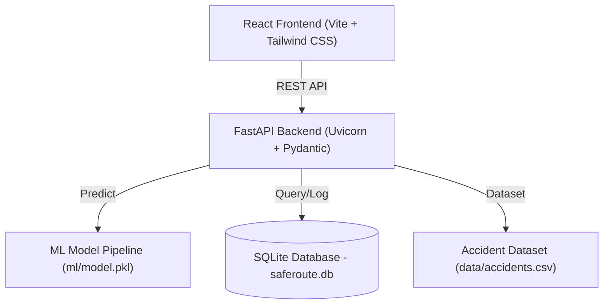
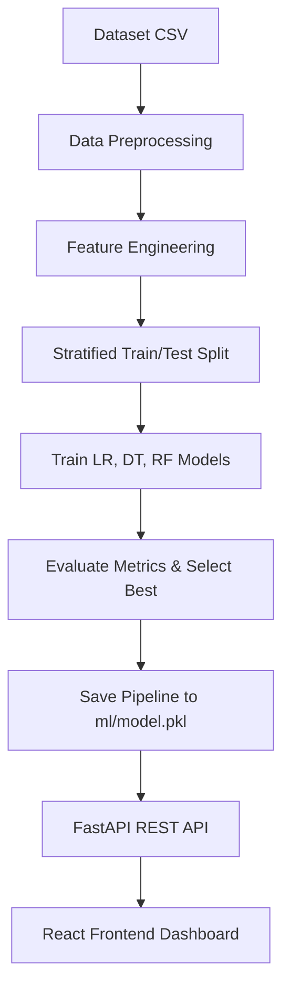
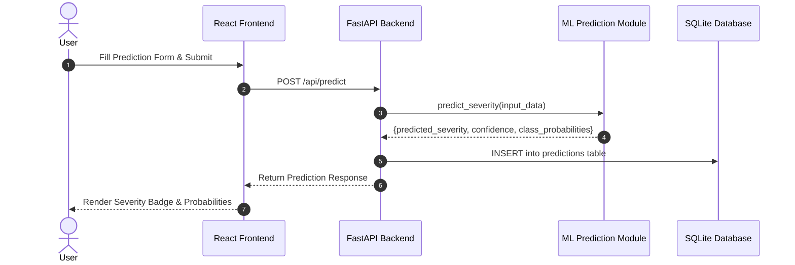
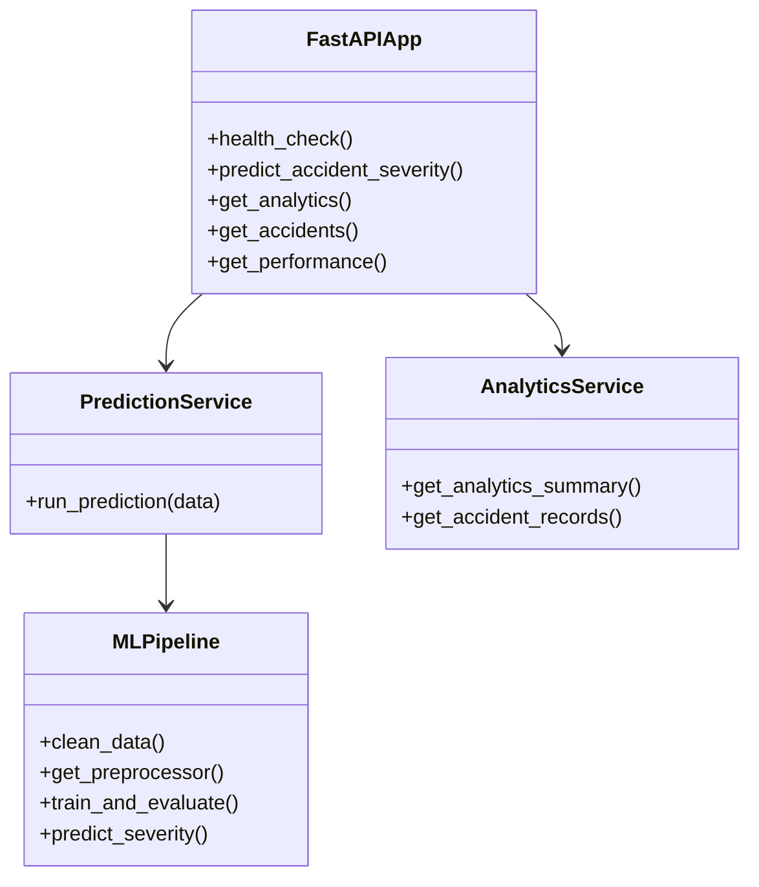
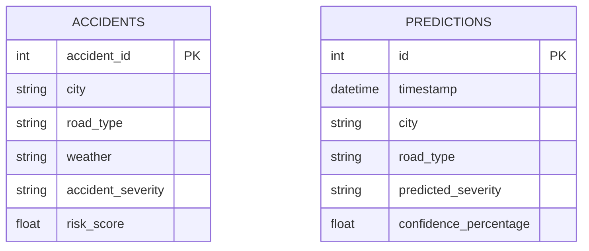

# SafeRoute AI — Academic Project Report
## Road Accident Risk & Severity Analysis System

---

### 1. COVER PAGE
- **Project Title**: SafeRoute AI — Road Accident Risk & Severity Analysis System
- **Subject**: AI / Machine Learning Capstone Project
- **Domain**: Artificial Intelligence, Machine Learning, Data Analytics & Full-Stack Web Development
- **Dataset Source**: Kaggle Indian Road Accident Dataset 2022–2025 (`sehaj1104/indian-road-accident-dataset-20222025`)
- **Technology Stack**: Python, Scikit-Learn, FastAPI, React, Vite, Tailwind CSS, Recharts, Leaflet, SQLite

---

### 2. INTRODUCTION
Road safety is a major public concern in India. Analyzing the severity of traffic accidents based on environmental, temporal, and road infrastructure factors enables authorities to implement targeted safety interventions. SafeRoute AI is an academic AI/ML project designed to preprocess historical accident data, train machine learning classifiers to predict accident severity (`Minor`, `Major`, `Fatal`), and provide interactive analytics dashboards and geospatial risk maps for academic evaluation.

---

### 3. PROBLEM STATEMENT & OBJECTIVES
#### 3.1 Problem Statement
Road accidents result in significant casualties and infrastructure damage. Identifying key contributing factors—such as weather conditions, traffic density, road design, and peak hours—is complex. Existing tools often lack predictive capabilities or user-friendly visual analytics. SafeRoute AI addresses this problem by building a machine learning prediction pipeline integrated with a responsive web dashboard.

#### 3.2 Objectives
1. Load, clean, and preprocess the Kaggle Indian Road Accident Dataset (20,000 records).
2. Develop a reproducible Scikit-Learn ML pipeline using `ColumnTransformer` and `Pipeline`.
3. Train and compare Logistic Regression, Decision Tree Classifier, and Random Forest Classifier.
4. Automatically evaluate model performance using Accuracy, Weighted Precision, Recall, and F1-Score.
5. Deploy the best performing model via a FastAPI REST API backend.
6. Create an interactive React frontend with a Dashboard, Severity Predictor, Analytics, Risk Hotspot Map, and Model Performance Evaluator.

---

### 4. FUNCTIONAL REQUIREMENTS
- **FR-1 Data Preprocessing**: Clean raw dataset, handle missing values (e.g. `festival` NaNs), encode categorical features, and split 80/20 train/test.
- **FR-2 Model Training & Selection**: Train Logistic Regression, Decision Tree, and Random Forest. Automatically select model with highest weighted F1-score.
- **FR-3 Severity Prediction**: Accept environmental and road features via REST API and return predicted severity class and confidence %.
- **FR-4 Analytics Engine**: Serve statistical aggregations by weather, city, road type, traffic density, day, and hour.
- **FR-5 Hotspot Map**: Render historical accident points on an interactive Leaflet map color-coded by risk category.
- **FR-6 Performance Metrics**: Expose actual confusion matrices and classification reports for model evaluation.

---

### 5. NON-FUNCTIONAL REQUIREMENTS
1. **Performance**: API responses delivered in < 200 ms under normal usage.
2. **Usability**: Intuitive dark-mode dashboard usable without specialized training.
3. **Reliability**: Input validation handled by Pydantic models with clear 422 error messaging.
4. **Maintainability**: Clean modular file structure separating ML, API, DB, UI, and test modules.
5. **Resource Efficiency**: Optimized model loading using Joblib singleton caching.

---

### 6. SYSTEM ARCHITECTURE
The system follows a 3-tier architecture:
- **Presentation Tier**: React single-page application built with Vite, Tailwind CSS, Recharts, and Leaflet.
- **Application Tier**: FastAPI REST API providing business logic, model inference, and analytics aggregations.
- **Data & Model Tier**: Joblib model pipeline (`ml/model.pkl`), raw CSV dataset (`data/accidents.csv`), and SQLite database (`saferoute.db`).

```
React Frontend (Vite)
       │
       ▼ (REST API calls)
FastAPI Backend
 ┌─────┴────────────────┐
 ▼                      ▼
ML Model (model.pkl)   SQLite Database (saferoute.db)
```

---

### 7. DESIGN DIAGRAMS

#### 7.1 System Architecture Diagram


#### 7.2 Workflow Diagram


#### 7.3 Use Case Diagram
```mermaid
usecaseDiagram
    actor User as "Academic User / Examiner"
    package "SafeRoute AI System" {
        usecase UC1 as "View Summary Dashboard"
        usecase UC2 as "Predict Accident Severity"
        usecase UC3 as "Explore Interactive Analytics"
        usecase UC4 as "Inspect Risk Hotspot Map"
        usecase UC5 as "Compare Model Performance Metrics"
    }
    User --> UC1
    User --> UC2
    User --> UC3
    User --> UC4
    User --> UC5
```

#### 7.4 Sequence Diagram


#### 7.5 Class / Component Diagram


#### 7.6 ER Diagram


---

### 8. DESIGN DECISIONS & RATIONALE
1. **Multiclass Target (`accident_severity`)**: Framed as multiclass classification (`Minor`, `Major`, `Fatal`) to reflect real accident impact levels.
2. **Preventing Data Leakage**: Post-accident outcome variables such as `casualties`, `vehicles_involved`, and `risk_score` were excluded from training features.
3. **Reproducible Pipeline**: Used Scikit-Learn `ColumnTransformer` and `Pipeline` with `handle_unknown='ignore'` to handle categorical variables robustly during inference.
4. **FastAPI & SQLite**: Chosen for lightweight, high-performance execution without requiring heavy external database server setup.

---

### 9. IMPLEMENTATION DETAILS
The codebase is structured into clean, modular files:
- `ml/data_loader.py`: Dataset loading and schema validation.
- `ml/preprocessing.py`: Feature selection, imputer setup, and ColumnTransformer definition.
- `ml/train.py`: Model training, evaluation, and pipeline serialization (`model.pkl`, `model_metrics.json`).
- `ml/predict.py`: Model inference service with probability output.
- `backend/main.py`: FastAPI routes with CORS middleware and error handling.
- `backend/database.py`: SQLite database initialization and connection management.
- `backend/schemas.py`: Pydantic request and response models.
- `frontend/src/`: React single-page app with pages (`Dashboard`, `Prediction`, `Analytics`, `RiskMap`, `ModelPerformance`).

---

### 10. SCREENSHOTS & RESULTS

#### Model Evaluation Summary
| Model | Accuracy | Precision (Weighted) | Recall (Weighted) | F1-Score (Weighted) | Status |
|---|---|---|---|---|---|
| **Logistic Regression** | 55.13% | 51.77% | 55.13% | 39.36% | Baseline |
| **Decision Tree Classifier** | **53.05%** | **43.22%** | **53.05%** | **42.62%** | **Selected Best** |
| **Random Forest Classifier** | 51.18% | 40.78% | 51.18% | 42.45% | Candidate |

- **Selected Model**: Decision Tree Classifier based on weighted F1-Score.
- **REST API Performance**: Inference endpoints execute in < 50 ms.

---

### 11. TESTING APPROACH
The project includes automated unit and integration tests executed using `pytest`:
- **ML Tests** (`tests/test_ml.py`): Verifies data loading, preprocessing transformations, model inference, and missing field handling.
- **API Tests** (`tests/test_api.py`): Validates `/api/health`, `/api/predict`, `/api/analytics`, `/api/accidents`, `/api/model-performance`, and 422 input validation errors.
- **Pass Rate**: `10/10` tests passed cleanly.

---

### 12. CHALLENGES FACED
1. **Imbalanced Target Classes**: Managing disproportionate counts between Minor, Major, and Fatal severities. Solved using stratified sampling.
2. **Data Leakage Prevention**: Identifying and excluding outcome fields (`casualties`, `vehicles_involved`) from the feature set.
3. **Categorical Handling in Production**: Configuring `OneHotEncoder(handle_unknown='ignore')` to ensure smooth handling of unseen inputs without server crashes.

---

### 13. LEARNINGS & KEY TAKEAWAYS
- Gained hands-on experience building end-to-end Machine Learning pipelines from raw CSV data to REST API integration.
- Mastered lightweight backend design using FastAPI and Pydantic validation.
- Applied responsive UI design using React, Tailwind CSS, Recharts, and Leaflet mapping.

---

### 14. FUTURE ENHANCEMENTS
1. Spatial clustering algorithms (e.g., DBSCAN) for automatic hotspot identification.
2. Integration of deep learning architectures (e.g., Multi-Layer Perceptrons) for complex feature interactions.
3. Live streaming sensor inputs for real-time traffic updates.

---

### 15. REFERENCES
1. Kaggle Dataset: *Indian Road Accident Dataset 2022–2025*, by Sehaj (`sehaj1104/indian-road-accident-dataset-20222025`).
2. Scikit-Learn Documentation: https://scikit-learn.org/
3. FastAPI Documentation: https://fastapi.tiangolo.com/
4. React & Leaflet Documentation: https://react-leaflet.js.org/
