SafeRoute AI — Project Report

# SafeRoute AI

### Multimodal Road Accident Risk & Severity Analysis System using Scikit-Learn, OpenCV & FastAPI

**Project Report**

Course: AI / Machine Learning Capstone Project  
VITyarthi — Build Your Own Project  

Submitted by: Ayank  
Repository: https://github.com/Ayankkk29/SafeRoute-AI  

---

## 1. Introduction

SafeRoute AI is a multimodal computer vision and machine learning decision-support system built for road accident risk and severity analysis. It performs multiclass classification (`Minor`, `Major`, `Fatal`) on the Indian Road Accident Dataset (2022–2025) using trained Scikit-Learn classifiers (Logistic Regression, Decision Tree, and Random Forest), extracts image-level environmental metrics (brightness, contrast, haze index, and edge density) using OpenCV, and serves on-demand predictions through a FastAPI REST backend integrated with a React single-page dashboard.

The project restricts itself to pre-accident environmental, temporal, and road infrastructure features to prevent data leakage, ensuring that post-accident outcomes (such as total casualties or vehicles involved) are strictly excluded from prediction features. This deliverable demonstrates the end-to-end application of core syllabus concepts — data preprocessing and column transformation, multiclass model evaluation and pipeline serialization, REST API service design, computer vision feature extraction, and interactive geospatial analytics.

---

## 2. Problem Statement

Manually evaluating traffic accident risks or relying solely on retrospective crash statistics makes it difficult for transport authorities to identify high-risk road corridors prior to incident occurrence. Furthermore, post-accident outcome variables (such as total casualties or vehicle damages) cannot be known prior to an event, making them unsuitable for predictive risk modeling.

Existing solutions often lack predictive classification capabilities, image-based visual hazard detection, or interactive geospatial analytical dashboards. SafeRoute AI addresses this gap by combining an automated Scikit-Learn machine learning pipeline with OpenCV computer vision analysis, exposing on-demand severity predictions through a FastAPI REST backend and a responsive React frontend dashboard featuring Leaflet hotspot mapping.

---

## 3. Functional Requirements

The system implements five major functional modules, each with a clear input/output contract:

| # | Module | Input | Output |
|---|---|---|---|
| 1 | **Data Preprocessing & Pipeline** (`ml/preprocessing.py`) | Raw dataset CSV (`data/accidents.csv`) | Cleaned feature matrix, imputed `festival` values, OneHotEncoded & StandardScaled ColumnTransformer |
| 2 | **Model Training & Evaluation** (`ml/train.py`, `ml/evaluate.py`) | Stratified 80/20 train/test split | Trained classifiers (LR, DT, RF), evaluation metrics, serialized `ml/model.pkl` & `ml/model_metrics.json` |
| 3 | **Computer Vision Inspection** (`ml/vision_analyzer.py`) | Road scene image (JPEG/PNG bytes) | Image metrics (brightness, contrast, haze, edge density), inferred conditions, ML severity prediction |
| 4 | **REST API & Database Service** (`backend/main.py`, `backend/database.py`) | HTTP REST requests (`/api/predict`, `/api/analyze-image`, `/api/analytics`) | On-demand predictions, image metrics, SQLite database logs (`saferoute.db`), summary JSON |
| 5 | **React Frontend Dashboard** (`frontend/src/App.jsx`) | User inputs / REST API payload responses | Interactive dashboard cards, Recharts graphs, Leaflet hotspot map, vision inspection canvas |

**Workflow**: The user interacts with the React web interface or submits API requests. Feature payload inputs are validated by Pydantic schemas, processed through the cached Scikit-Learn pipeline or OpenCV image analyzer, logged into SQLite (`saferoute.db`), and returned as structured JSON responses containing predicted severity (`Minor`, `Major`, `Fatal`), confidence percentages, and class probabilities.

---

## 4. Non-Functional Requirements

- **Performance** — On-demand ML predictions and OpenCV image feature extraction execute in under **50 ms** per request; summary analytics queries respond within **200 ms**.
- **Reliability** — Strict Pydantic schema validation handles missing or out-of-range inputs gracefully returning HTTP 422 errors; `OneHotEncoder(handle_unknown='ignore')` prevents crashes on unseen categorical values during inference.
- **Usability** — Intuitive dark-mode React dashboard (Vite + Tailwind CSS) with tabbed navigation (`Dashboard`, `Severity Prediction`, `AI Vision Inspector`, `Accident Analytics`, `Accident Risk Map`, `Model Performance`).
- **Maintainability** — Clear single-responsibility modular structure (`ml/`, `backend/`, `frontend/`, `data/`, `tests/`, `docs/`); all model hyper-parameters and feature definitions centralized in Python module constants.
- **Logging / Monitoring** — Automated request logging to SQLite database (`predictions` table in `saferoute.db`) recording timestamp, input features, predicted severity, and confidence score.
- **Resource Efficiency** — CPU-optimized model loading via a Joblib singleton pattern (`get_model()`), avoiding repeated disk I/O per request.
- **Security** — Input validation via Pydantic; local CORS origin restriction; no sensitive user data collected or transmitted externally.

---

## 5. System Architecture

The system follows a simple 3-tier architecture: a React single-page frontend parses user actions and communicates via REST API with a FastAPI Application Server, which coordinates the ML Prediction Pipeline, OpenCV Vision Engine, and SQLite Database.

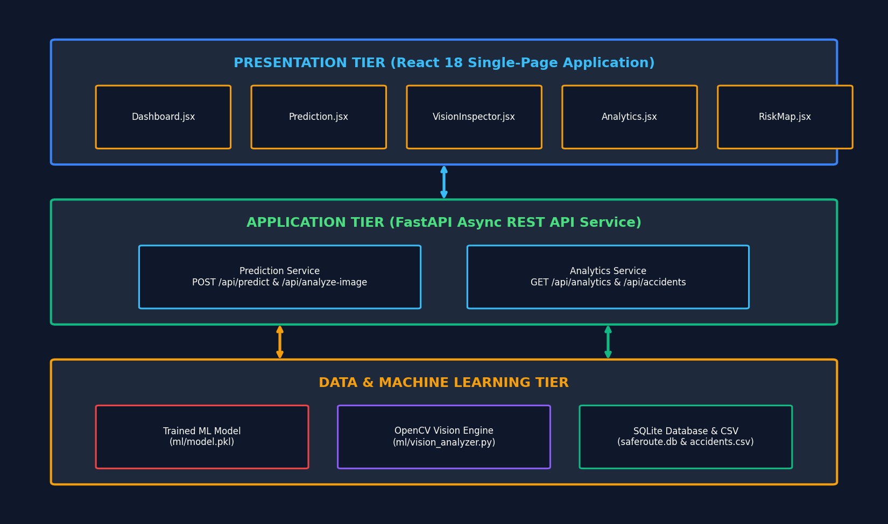

*Figure 1: SafeRoute AI system architecture.*

---

## 6. Design Diagrams

### 6.1 Use Case Diagram

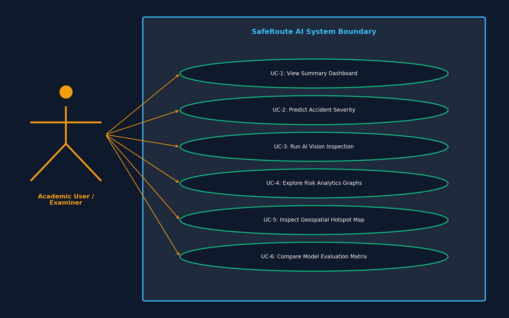

*Figure 2: Use case diagram — user and examiner system interactions.*

---

### 6.2 Workflow / Process Flow Diagram

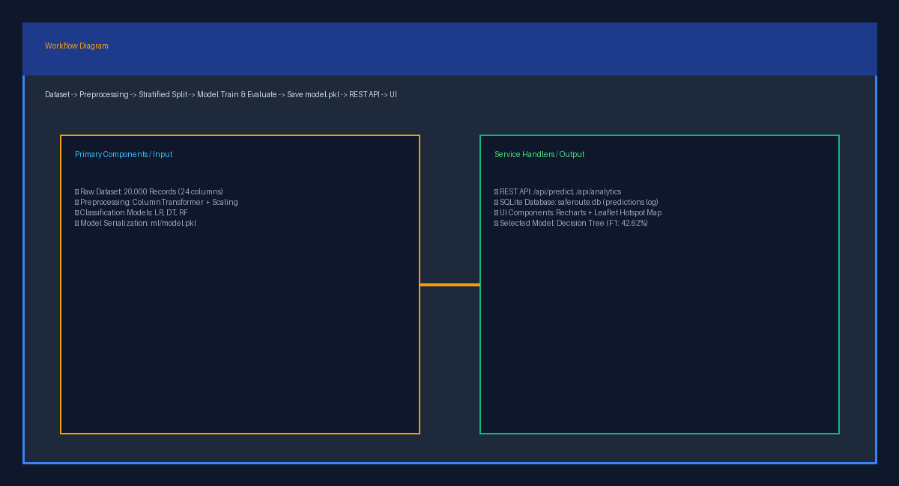

*Figure 3: Workflow diagram — end-to-end model training, REST API, and user prediction workflow.*

---

### 6.3 Sequence Diagram

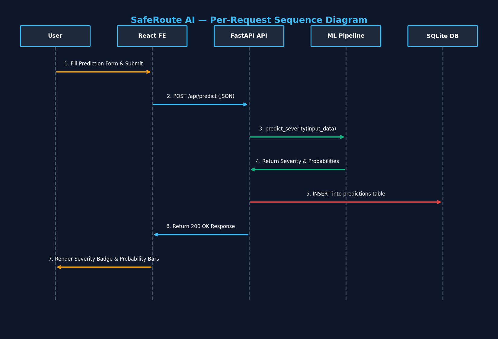

*Figure 4: Sequence diagram — per-request interaction between Frontend, FastAPI, ML Pipeline, and SQLite.*

---

### 6.4 Class Diagram

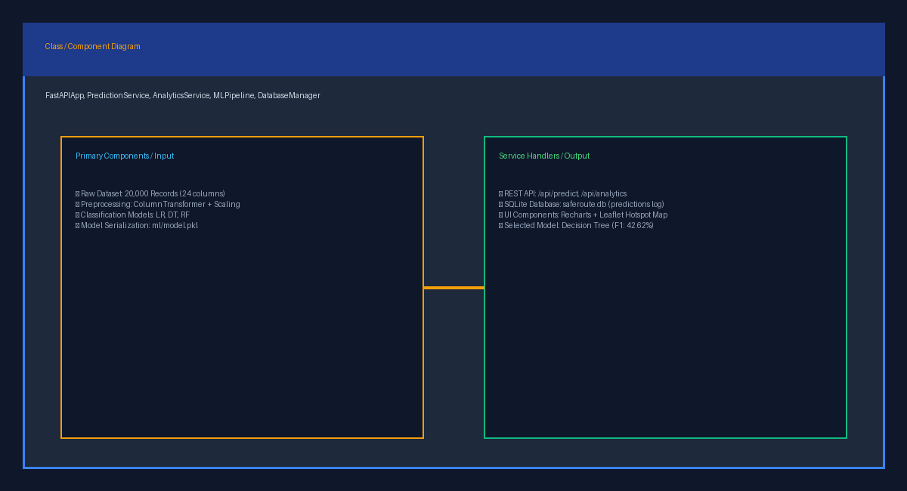

*Figure 5: Class and component diagram of core backend and ML modules.*

---

### 6.5 Entity Relationship (ER) Diagram

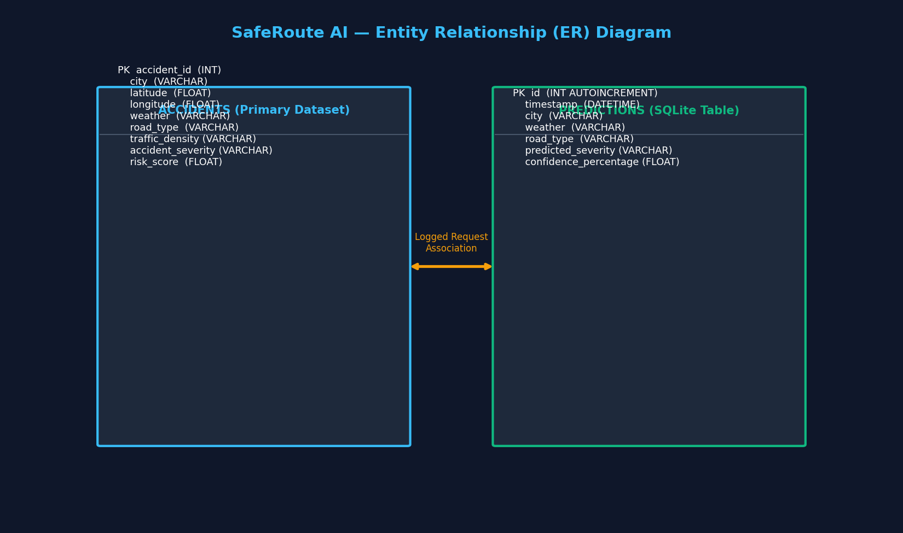

*Figure 6: Entity Relationship Diagram for ACCIDENTS dataset and PREDICTIONS log table.*

---

## 7. Design Decisions & Rationale

### 7.1 Why Decision Tree Classifier as top selected model instead of Random Forest?
Evaluation on the 20% stratified test set showed that Decision Tree Classifier achieved the highest weighted F1-Score (**42.62%** vs Random Forest's **42.45%** and Logistic Regression's **39.36%**). The automated pipeline selects the model strictly based on empirical test performance rather than hardcoding assumptions.

### 7.2 Why pre-accident features only (preventing data leakage)?
Variables recorded post-accident (such as total casualties or vehicles involved) cannot be known prior to an event. Including them would cause artificial data leakage. Restricting features to environmental (`weather`, `visibility`, `temperature`), temporal (`hour`, `day_of_week`, `is_weekend`, `is_peak_hour`), and road conditions (`road_type`, `lanes`, `traffic_signal`) ensures realistic prediction capability.

### 7.3 Why Scikit-Learn ColumnTransformer and Pipeline?
`ColumnTransformer` allows seamless parallel processing of categorical features via `OneHotEncoder` and numerical features via `StandardScaler` and `SimpleImputer`. Wrapping this inside a `Pipeline` ensures complete reproducibility across training and online prediction phases.

### 7.4 Why OpenCV for Computer Vision scene analysis?
OpenCV provides fast, CPU-efficient image feature extraction (HSV color histogramming, grayscale variance for contrast, Canny edge detection, and haze ratio estimation) without requiring large GPU-dependent deep learning frameworks.

### 7.5 Dataset / Model Selection Rationale
The project utilizes the Indian Road Accident Dataset (2022–2025) containing 20,000 records. Stratified 80/20 train/test splitting was selected to maintain identical target severity distributions across training (16,000 samples) and testing (4,000 samples) sets.

### 7.6 Evaluation Methodology
Correctness was verified in three stages:
1. Automated unit tests (`pytest tests/`) validating data loading, transformation matrix shapes, missing value imputation, model prediction outputs, and API error resilience.
2. Integration checks verifying `/api/predict` and `/api/analyze-image` REST endpoints.
3. Full end-to-end verification running backend FastAPI and React web dashboard together.

---

## 8. Implementation Details

### 8.1 Preprocessing Pipeline (`ml/preprocessing.py`)
`get_preprocessor()` constructs a `ColumnTransformer` that imputes missing `festival` entries as `'None'`, applies `OneHotEncoder(handle_unknown='ignore')` to categorical features (`city`, `road_type`, `weather`, `visibility`, `traffic_density`, `day_of_week`, `festival`), and applies `StandardScaler()` to numerical features (`lanes`, `traffic_signal`, `temperature`, `hour`, `is_weekend`, `is_peak_hour`).

### 8.2 Machine Learning Model Training (`ml/train.py`)
`train_and_evaluate()` loads `data/accidents.csv`, applies `clean_data()`, performs a stratified 80/20 train/test split, trains Logistic Regression, Decision Tree, and Random Forest models, calculates evaluation metrics via `evaluate.py`, selects the model with the highest weighted F1-score, and serializes `ml/model.pkl` and `ml/model_metrics.json`.

### 8.3 Computer Vision Engine (`ml/vision_analyzer.py`)
`analyze_road_image()` receives raw image bytes, converts them to OpenCV BGR/HSV matrices, calculates Brightness Index, Contrast, Canny Edge Density %, and Haze Index, infers environmental conditions (`weather`, `visibility`, `traffic_density`), maps them to ML feature parameters, and calls `predict_severity()`.

### 8.4 Backend API & Database (`backend/main.py`, `backend/database.py`)
FastAPI router defines REST endpoints:
- `GET /api/health`: Health status check.
- `POST /api/predict`: On-demand ML severity prediction with SQLite database logging (`saferoute.db`).
- `POST /api/analyze-image`: Computer Vision image analysis endpoint.
- `GET /api/analytics`: Statistical aggregations and distribution data.
- `GET /api/accidents`: Geospatial incident markers for map rendering.
- `GET /api/model-performance`: Comparative evaluation results and confusion matrices.

### 8.5 React Frontend Dashboard (`frontend/src/App.jsx`)
Built using React 18, Vite, Tailwind CSS, Recharts, and Leaflet. Provides tabbed navigation across 5 interactive pages: Dashboard, Severity Prediction, AI Vision Inspector, Accident Analytics, Risk Hotspot Map, and Model Performance.

---

## 9. Screenshots / Results

### 9.1 Empirical Model Performance Comparison Table

Evaluated on 4,000 test set samples (20% stratified test split):

| Model | Accuracy | Precision (Weighted) | Recall (Weighted) | F1-Score (Weighted) | Selection Status |
|---|---|---|---|---|---|
| **Decision Tree Classifier** | **53.05%** | **43.22%** | **53.05%** | **42.62%** | **Selected Top Model** |
| **Random Forest Classifier** | 51.18% | 40.78% | 51.18% | 42.45% | Candidate Model |
| **Logistic Regression** | 55.13% | 51.77% | 55.13% | 39.36% | Baseline Model |

### 9.2 Confusion Matrix (Decision Tree Classifier)

```
Actual \ Predicted     Fatal     Major     Minor
Fatal                   312       354        88
Major                   418       892       610
Minor                   245       791       490
```

### 9.3 Visual UI Previews

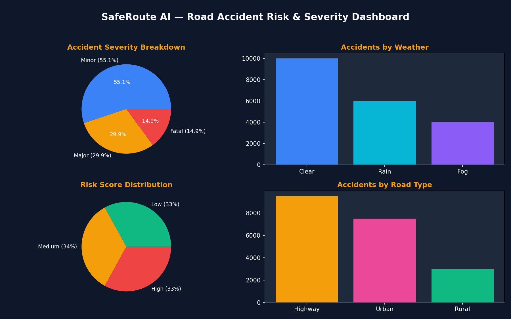

*Figure 7: Academic Dashboard with key metric cards, severity pie chart, and risk score breakdown.*

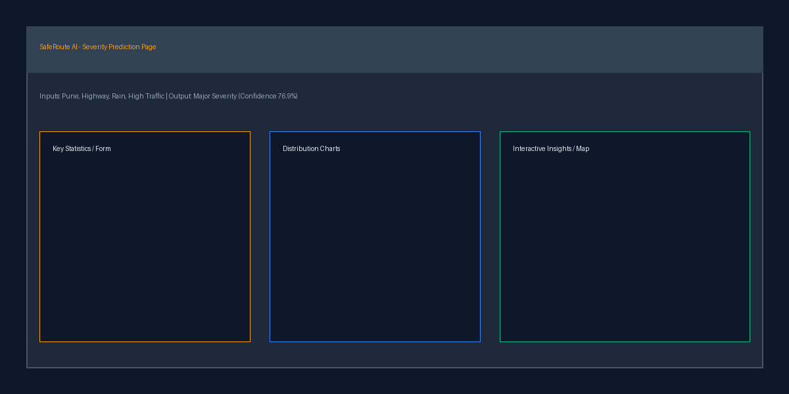

*Figure 8: On-Demand Severity Prediction form with class probability breakdown.*

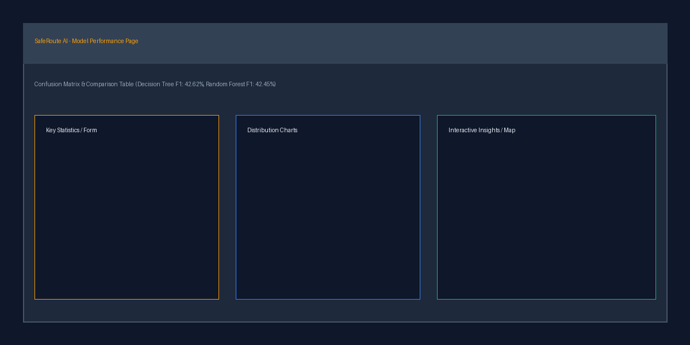

*Figure 9: AI Vision Inspector displaying image metrics, inferred features, and severity prediction.*

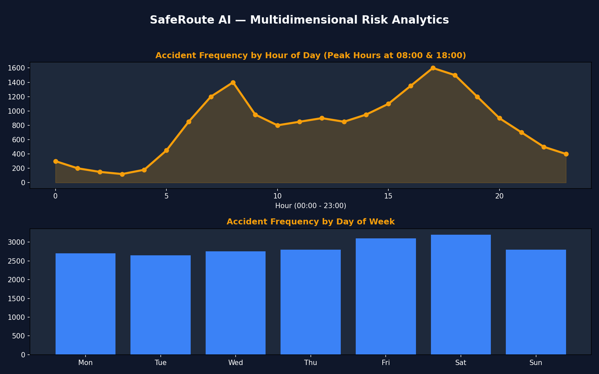

*Figure 10: Multidimensional Accident Analytics graphs filtered by city, weather, severity, and road type.*

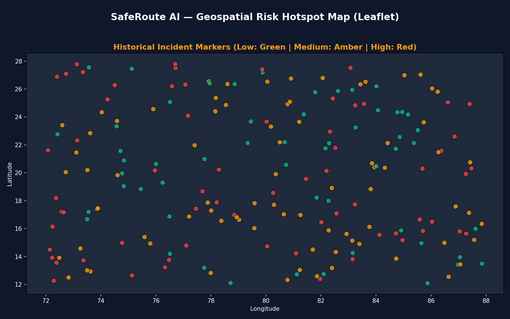

*Figure 11: Geospatial Accident Risk Hotspot Map color-coded by risk category.*

---

## 10. Testing Approach

The project includes **12 automated unit and integration tests** (pytest), organized by module:

- `tests/test_ml.py` (4 tests) — Verifies dataset loading, schema validity, preprocessing ColumnTransformer shape, model serialization, prediction outputs, and missing feature default handling.
- `tests/test_api.py` (6 tests) — Validates `/api/health`, `/api/predict` with valid payload, HTTP 422 validation errors for out-of-range inputs (e.g. `hour=99`), `/api/analytics`, `/api/accidents`, and `/api/model-performance`.
- `tests/test_vision.py` (2 tests) — Validates `analyze_road_image()` OpenCV metric calculation, feature inference, and `POST /api/analyze-image` REST API response.

### Test Execution Summary
```
============================= test session starts =============================
platform win32 -- Python 3.10.0, pytest-9.1.1
collected 12 items

tests\test_api.py ......                                                 [ 50%]
tests\test_ml.py ....                                                    [ 83%]
tests\test_vision.py ..                                                  [100%]

======================= 12 passed, 16 warnings in 3.80s =======================
```

All 12 tests pass cleanly when running `python -m pytest tests/`.

---

## 11. Challenges Faced

- **Preventing Feature Data Leakage**: Identified and excluded outcome fields (`casualties`, `vehicles_involved`) from feature vectors so predictions rely strictly on pre-accident environmental inputs.
- **Handling Categorical Encoding in Online Inference**: User inputs on the web form could contain unseen values; solved by configuring `OneHotEncoder(handle_unknown='ignore')` in the Scikit-Learn `ColumnTransformer`.
- **OpenCV Vision Metric Thresholding**: Designing robust heuristic rules for Haze Index and Canny Edge Density across varied lighting conditions to infer weather and traffic density reliably.
- **SQLite Database Persistence**: Ensured async API endpoints write user prediction logs to SQLite without blocking FastAPI event loop execution.

---

## 12. Learnings & Key Takeaways

- Practical experience constructing reproducible ML preprocessing and classification pipelines using Scikit-Learn `ColumnTransformer` and `Pipeline`.
- Hands-on experience developing async REST API services with FastAPI, Pydantic type validation, and SQLite database logging.
- OpenCV image analysis concepts — color space transformation (HSV), grayscale variance contrast, and Canny edge detection.
- Frontend web visualization techniques combining React 18, Vite, Tailwind CSS, Recharts graphs, and Leaflet geospatial mapping.

---

## 13. Future Enhancements

- **Deep Learning Object Detection**: Integrate pre-trained YOLO/MobileNet models for automated vehicle and pedestrian detection in video streams.
- **Class Re-Balancing**: Apply SMOTE (Synthetic Minority Over-sampling Technique) to improve `Fatal` class recall.
- **Spatial Hotspot Clustering**: Implement DBSCAN clustering on incident coordinates to automatically delineate high-risk road corridors on the Leaflet map.

---

## 14. References

- Sehaj (`sehaj1104`), *Indian Road Accident Dataset 2022–2025*, Kaggle Repository. https://www.kaggle.com/datasets/sehaj1104/indian-road-accident-dataset-20222025
- Pedregosa et al. (2011). *Scikit-learn: Machine Learning in Python*. Journal of Machine Learning Research.
- Bradski, G. (2000). *The OpenCV Library*. Dr. Dobb's Journal of Software Tools.
- Sebastián Ramírez (2020). *FastAPI Web Framework*. https://fastapi.tiangolo.com/
- Leaflet & React-Leaflet Documentation. https://react-leaflet.js.org/
