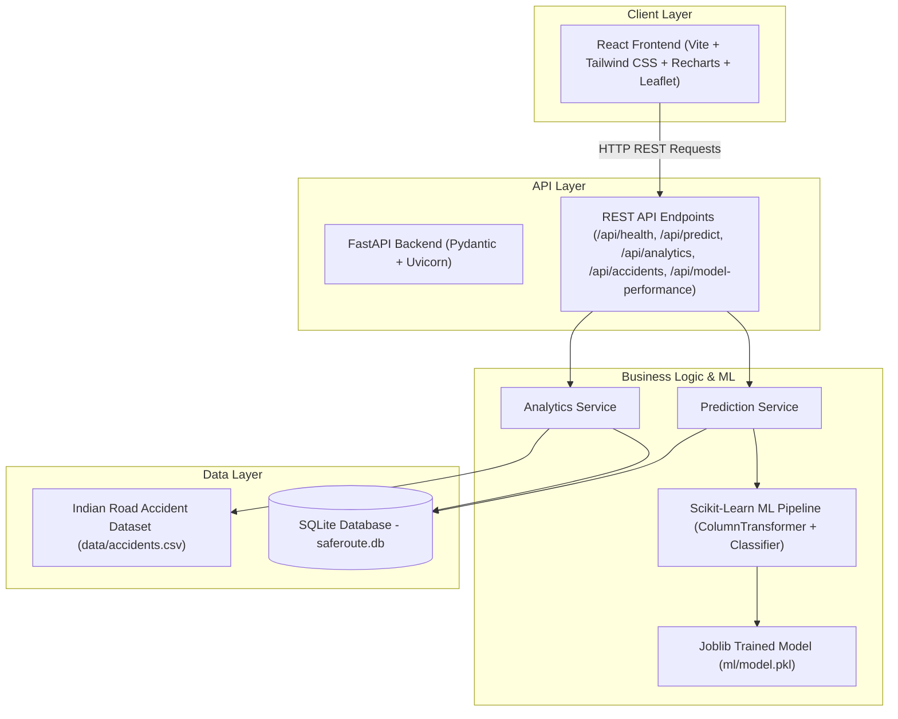

# System Architecture Diagram

```mermaid
graph TD
    subgraph Client Layer
        ReactApp["React Frontend (Vite + Tailwind CSS + Recharts + Leaflet)"]
    end

    subgraph API Layer
        FastAPI["FastAPI Backend (Pydantic + Uvicorn)"]
        Endpoints["REST API Endpoints (/api/health, /api/predict, /api/analytics, /api/accidents, /api/model-performance)"]
    end

    subgraph Business Logic & ML
        PredService["Prediction Service"]
        AnalyticService["Analytics Service"]
        MLPipeline["Scikit-Learn ML Pipeline (ColumnTransformer + Classifier)"]
        SavedModel["Joblib Trained Model (ml/model.pkl)"]
    end

    subgraph Data Layer
        Dataset["Indian Road Accident Dataset (data/accidents.csv)"]
        DB[(SQLite Database - saferoute.db)]
    end

    ReactApp -->|HTTP REST Requests| Endpoints
    Endpoints --> PredService
    Endpoints --> AnalyticService
    PredService --> MLPipeline
    MLPipeline --> SavedModel
    AnalyticService --> Dataset
    AnalyticService --> DB
    PredService --> DB
```
