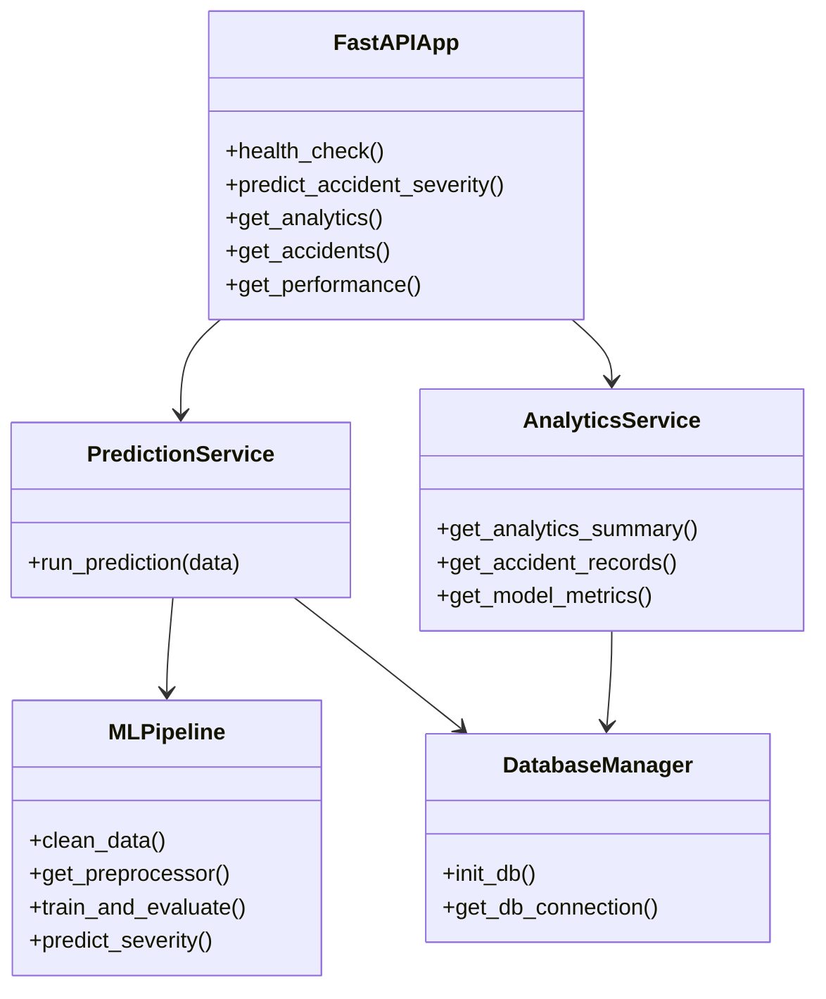

# Class & Component Diagram

```mermaid
classDiagram
    class FastAPIApp {
        +health_check()
        +predict_accident_severity()
        +get_analytics()
        +get_accidents()
        +get_performance()
    }

    class PredictionService {
        +run_prediction(data)
    }

    class AnalyticsService {
        +get_analytics_summary()
        +get_accident_records()
        +get_model_metrics()
    }

    class MLPipeline {
        +clean_data()
        +get_preprocessor()
        +train_and_evaluate()
        +predict_severity()
    }

    class DatabaseManager {
        +init_db()
        +get_db_connection()
    }

    FastAPIApp --> PredictionService
    FastAPIApp --> AnalyticsService
    PredictionService --> MLPipeline
    PredictionService --> DatabaseManager
    AnalyticsService --> DatabaseManager
```
