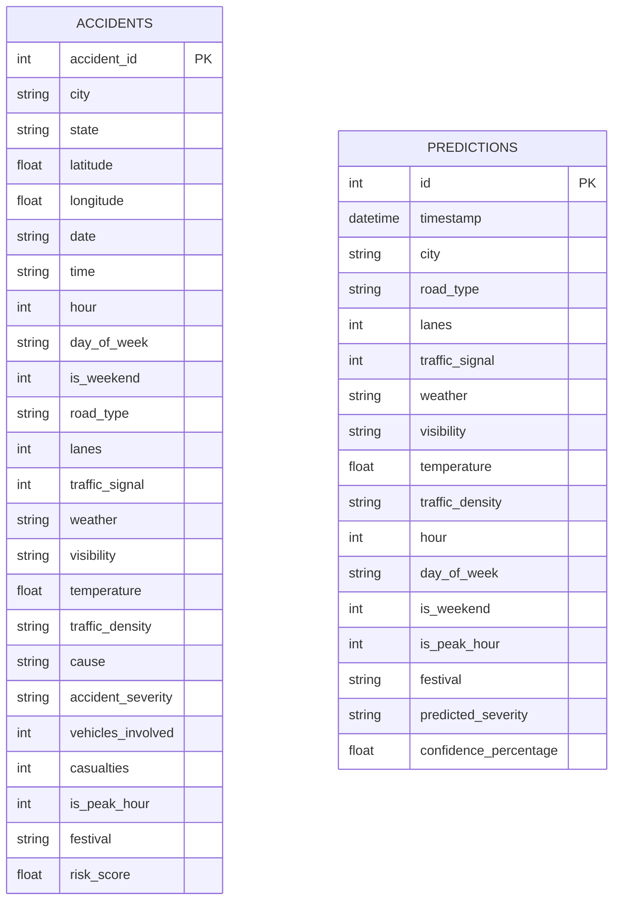

# Entity Relationship (ER) Diagram

```mermaid
erDiagram
    ACCIDENTS {
        int accident_id PK
        string city
        string state
        float latitude
        float longitude
        string date
        string time
        int hour
        string day_of_week
        int is_weekend
        string road_type
        int lanes
        int traffic_signal
        string weather
        string visibility
        float temperature
        string traffic_density
        string cause
        string accident_severity
        int vehicles_involved
        int casualties
        int is_peak_hour
        string festival
        float risk_score
    }

    PREDICTIONS {
        int id PK
        datetime timestamp
        string city
        string road_type
        int lanes
        int traffic_signal
        string weather
        string visibility
        float temperature
        string traffic_density
        int hour
        string day_of_week
        int is_weekend
        int is_peak_hour
        string festival
        string predicted_severity
        float confidence_percentage
    }
```
