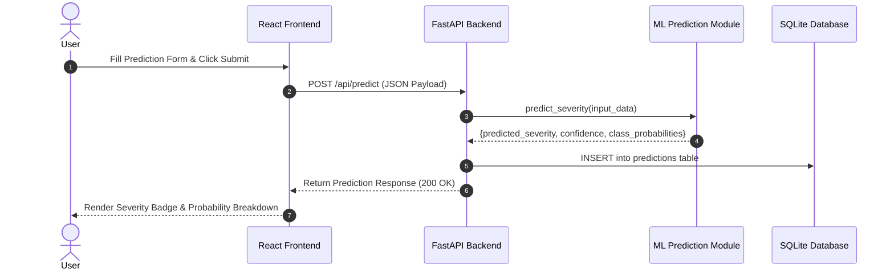

# Sequence Diagram

```mermaid
sequenceDiagram
    autonumber
    actor User as User
    participant FE as React Frontend
    participant API as FastAPI Backend
    participant ML as ML Prediction Module
    participant DB as SQLite Database

    User->>FE: Fill Prediction Form & Click Submit
    FE->>API: POST /api/predict (JSON Payload)
    API->>ML: predict_severity(input_data)
    ML-->>API: {predicted_severity, confidence, class_probabilities}
    API->>DB: INSERT into predictions table
    API-->>FE: Return Prediction Response (200 OK)
    FE-->>User: Render Severity Badge & Probability Breakdown
```
