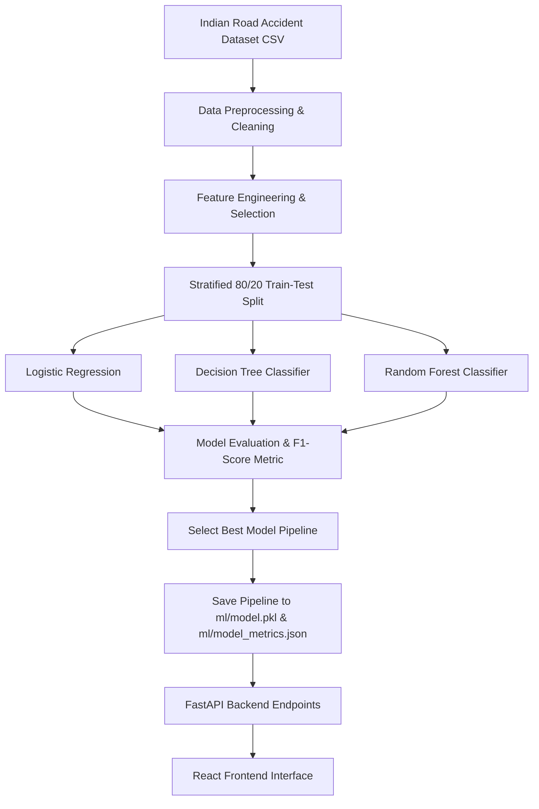

# Workflow Diagram

```mermaid
flowchart TD
    A[Indian Road Accident Dataset CSV] --> B[Data Preprocessing & Cleaning]
    B --> C[Feature Engineering & Selection]
    C --> D[Stratified 80/20 Train-Test Split]
    D --> E1[Logistic Regression]
    D --> E2[Decision Tree Classifier]
    D --> E3[Random Forest Classifier]
    E1 --> F[Model Evaluation & F1-Score Metric]
    E2 --> F
    E3 --> F
    F --> G[Select Best Model Pipeline]
    G --> H[Save Pipeline to ml/model.pkl & ml/model_metrics.json]
    H --> I[FastAPI Backend Endpoints]
    I --> J[React Frontend Interface]
```
